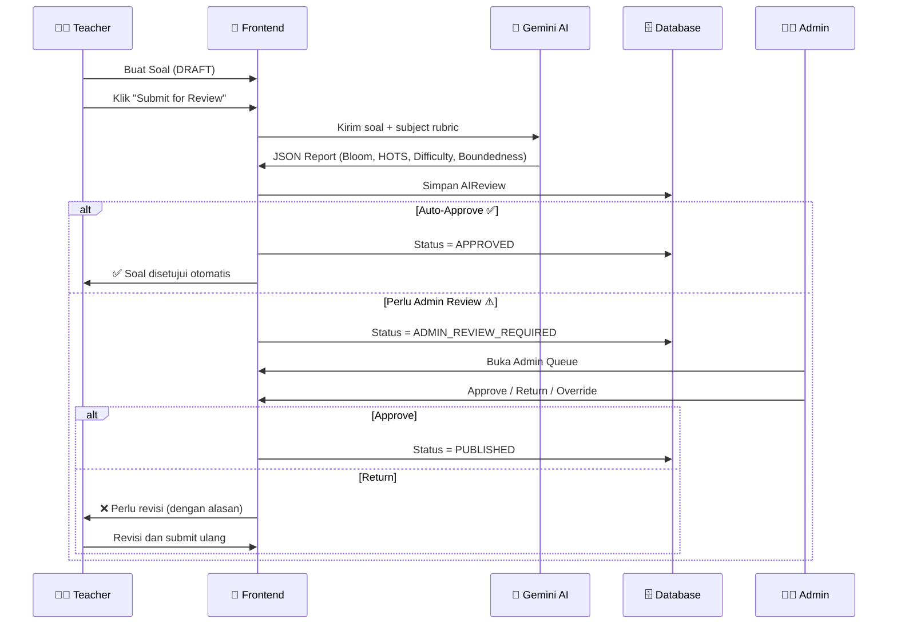
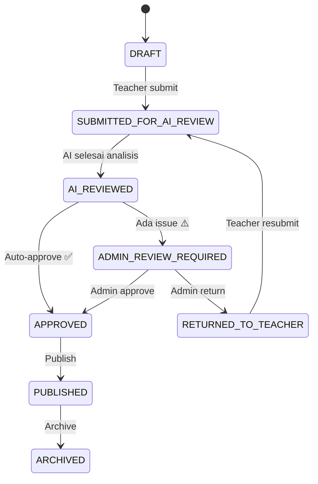

# 🎯 HOTS / Bloom's Taxonomy AI Quality Control — Feature Guide

> **Tujuan dokumen ini:** Panduan lengkap untuk implementasi fitur HOTS/Bloom QC di aplikasi lain.
> Berisi arsitektur, flow, logika AI, routing rules, UI components, dan database schema.

---

## 1. Ringkasan Fitur

Sistem **HOTS QC** (Higher-Order Thinking Skills Quality Control) adalah pipeline otomatis yang:
1. **Menganalisis soal** dengan AI (Gemini) untuk menentukan level Bloom, HOTS, difficulty, dan boundedness
2. **Routing otomatis** ke Admin Queue jika soal bermasalah (mismatch difficulty, ambiguity, dll)
3. **Auto-approve** soal yang berkualitas tinggi tanpa perlu admin review
4. **Feedback ke guru** berupa suggested edits dan alasan penolakan

---

## 2. Arsitektur Sistem



---

## 3. State Machine (Status Soal)



### Status Definitions

| Status | Deskripsi | Warna Badge |
|--------|-----------|-------------|
| `draft` | Soal baru dibuat, belum di-review | Gray |
| `submitted_for_review` | Menunggu AI analysis | Blue |
| `ai_reviewed` | AI selesai, sedang di-route | Purple |
| `admin_review_required` | Perlu cek manual admin | Orange |
| `returned_to_teacher` | Dikembalikan untuk revisi | Red |
| `approved` | Disetujui, siap publish | Green |
| `published` | Sudah live untuk siswa | Green |
| `archived` | Diarsipkan | Gray |

---

## 4. Definisi Sistem (System Truth)

### 4.1 Bloom's Taxonomy (Level 1–6)

Assign **satu primary level** berdasarkan **cognitive action tertinggi** yang dibutuhkan:

| Level | Nama | Nama (ID) | Contoh Kata Kerja |
|-------|------|-----------|-------------------|
| 1 | Remember | Mengingat | Sebutkan, definisikan, daftar |
| 2 | Understand | Memahami | Jelaskan, rangkum, bandingkan |
| 3 | Apply | Menerapkan | Hitung, gunakan, terapkan |
| 4 | Analyze | Menganalisis | Bandingkan, identifikasi pola, debug |
| 5 | Evaluate | Mengevaluasi | Nilai, kritik, pilih yang terbaik |
| 6 | Create | Mencipta | Rancang, buat, susun strategi |

> ⚠️ **Bloom ≠ Difficulty.** Soal Bloom 4 bisa mudah jika well-scaffolded.

### 4.2 HOTS (Higher-Order Thinking Skills)

**HOTS = Bloom 4–6** DAN mengandung minimal satu **HOTS signal**:
- Compare/contrast dengan reasoning
- Identifikasi relationships/patterns/inference
- Debug reasoning / error analysis
- Evaluate options menggunakan criteria/trade-offs
- Create/design solution dengan constraints

**HOTS Strength:**

| Code | Level | Deskripsi |
|------|-------|-----------|
| S2 | Strong | Explicit criteria/constraints/evidence/debug required |
| S1 | Medium | "Jelaskan mengapa" tapi struktur lemah |
| S0 | Weak | Terlihat HOTS tapi output masih recall/summary |

### 4.3 Boundedness (Keterbatasan Soal)

Mengukur apakah soal **cukup terdefinisi** untuk dijawab tanpa kebingungan.

| Code | Level | Deskripsi |
|------|-------|-----------|
| B2 | Good | Info lengkap + format output jelas + scope + rubrik |
| B1 | Partial | Beberapa elemen kurang jelas tapi masih bisa dijawab |
| B0 | Bad | Butuh research external / info kunci hilang / grading ambigu |

> B0 otomatis masuk Admin Queue.

### 4.4 Difficulty Score (0–10)

Dihitung dari 3 komponen:

| Komponen | Range | Detail |
|----------|-------|--------|
| Steps/complexity | 0–4 | 1 step=0, 2=1, 3-4=2, 5-6=3, 7+=4 |
| Prerequisite load | 0–3 | 1 concept=0, 2=1, 3=2, 4+=3 |
| Reading/data load | 0–3 | short=0, moderate=1, heavy=2, long+complex=3 |

**Mapping:** 0–3 Easy, 4–6 Medium, 7–10 Hard

---

## 5. Subject Rubrics (Per Mata Pelajaran)

Rubric ini digunakan oleh AI, Teacher, dan Admin sebagai pedoman klasifikasi.

### 5.1 Science (IPA)

```javascript
{
    bloom_signals: {
        1: 'Recall terms, laws, units, definitions',
        2: 'Explain concept; interpret simple diagram',
        3: 'Apply formula or standard procedure to a scenario',
        4: 'Interpret data; identify variables; cause-effect; compare experiments',
        5: 'Critique conclusions; choose best method using criteria',
        6: 'Design investigation/solution under constraints'
    },
    hots_triggers: [
        'Data/graph interpretation with reasoning',
        'Experimental design with constraints/controls',
        'Evaluation using explicit criteria'
    ],
    risk_flags: [
        'Missing variables/control definition',
        'Too complex datasets for grade',
        'Requires outside niche knowledge'
    ]
}
```

### 5.2 Math (Matematika)

```javascript
{
    bloom_signals: {
        1: 'Recall formula/definition',
        2: 'Explain meaning of steps; interpret representation',
        3: 'Solve using known procedure',
        4: 'Compare strategies; debug errors; case analysis; pattern analysis',
        5: 'Judge method correctness/efficiency using criteria',
        6: 'Construct model/rule; generalization; create problem under constraints'
    },
    hots_triggers: [
        'Error analysis (debug)',
        'Compare 2 methods + justify choice',
        'Modeling with assumptions'
    ],
    risk_flags: [
        'Ambiguous constraints leading to multiple correct answers',
        'Too many steps with no scaffold',
        'Heavy reading word problems'
    ]
}
```

### 5.3 English

```javascript
{
    bloom_signals: {
        1: 'Vocabulary/grammar recall',
        2: 'Summarize/paraphrase; main idea',
        3: 'Apply grammar/vocab to produce short text',
        4: 'Analyze tone/structure/purpose; compare perspectives; identify fallacies',
        5: 'Evaluate argument credibility/strength using criteria',
        6: 'Create/transform text for audience/purpose with constraints'
    },
    hots_triggers: [
        'Requires evidence from text',
        'Evaluates arguments with criteria',
        'Rewrite/transform for specified audience/purpose'
    ],
    risk_flags: [
        'Reading too long without scaffold',
        'Cultural knowledge not provided',
        'Missing writing rubric'
    ]
}
```

### 5.4 Civics (PPKn)

```javascript
{
    bloom_signals: {
        1: 'Recall principles/institutions',
        2: 'Explain meaning/values; roles',
        3: 'Apply rules/values to straightforward case',
        4: 'Analyze stakeholders; rights/duties conflicts; causal chain',
        5: 'Evaluate policy/action using criteria (justice, legality, public good)',
        6: 'Propose program/policy with constraints + steps + success metrics'
    },
    hots_triggers: [
        'Explicit criteria & trade-offs',
        'Stakeholder table / cause-effect mapping',
        'Constrained solution proposal with implementation steps'
    ],
    risk_flags: [
        'Opinion-only prompts without criteria',
        'Scenario lacking context',
        'Sensitive topics needing neutrality'
    ]
}
```

### 5.5 Economy (Ekonomi)

```javascript
{
    bloom_signals: {
        1: 'Define terms (inflation, demand, GDP)',
        2: 'Explain relationships (cause-effect) simply',
        3: 'Compute/basic interpretation (graphs, simple metrics)',
        4: 'Analyze trends, causal chains, compare market outcomes using data',
        5: 'Evaluate policy options with criteria (efficiency, equity, stability)',
        6: 'Design strategy/business/policy proposal with assumptions + constraints'
    },
    hots_triggers: [
        'Decision table with criteria + trade-offs',
        'Data interpretation + justification',
        'Constrained policy/business proposal'
    ],
    risk_flags: [
        'Claims without evidence requirement',
        'Ambiguous variables/timeframe',
        'Math-heavy without required data/formula'
    ]
}
```

### 5.6 Menambah Subject Baru

Untuk menambah mata pelajaran baru:

```javascript
const SUBJECT_RUBRICS = {
    // ... existing subjects ...
    
    // Tambahkan subject baru:
    history: {
        name: 'Sejarah',
        bloom_signals: {
            1: 'Recall dates, figures, events',
            2: 'Explain causes and effects of events',
            3: 'Apply historical concepts to new contexts',
            4: 'Compare different historical perspectives',
            5: 'Evaluate historical sources for bias and reliability',
            6: 'Construct historical narrative with evidence and analysis'
        },
        hots_triggers: [
            'Source analysis with bias identification',
            'Multiple perspective comparison',
            'Evidence-based argumentation'
        ],
        risk_flags: [
            'Single-perspective narrative',
            'Memorization-only questions',
            'Anachronistic framing'
        ]
    }
};
```

---

## 6. AI QC Output Schema (JSON Yang Dihasilkan AI)

```json
{
    "primary_bloom_level": 4,
    "secondary_bloom_levels": [2, 3],
    "hots": {
        "flag": true,
        "strength": "S2",
        "signals": ["Data interpretation with reasoning", "Compare experiments"]
    },
    "boundedness": "B2",
    "difficulty": {
        "score_1_10": 6,
        "label": "medium",
        "reasons": ["3-4 steps required", "Moderate reading load"]
    },
    "quality": {
        "clarity_score_0_100": 85,
        "ambiguity_flags": [],
        "missing_info_flags": [],
        "grade_fit_flags": []
    },
    "alignment": {
        "subject_match_score_0_100": 92,
        "topic_match_score_0_100": 88
    },
    "suggested_edits": [
        {
            "goal": "add_hots",
            "change_summary": "Add explicit evaluation criteria",
            "before": "Jelaskan mengapa...",
            "after": "Berdasarkan data X dan Y, evaluasi menggunakan kriteria Z..."
        }
    ],
    "confidence": {
        "bloom": 0.85,
        "hots": 0.78,
        "difficulty": 0.72,
        "boundedness": 0.90
    },
    "model_version": "qc-v1"
}
```

### Validasi Wajib

| Field | Tipe | Constraint |
|-------|------|-----------|
| `primary_bloom_level` | Integer | 1–6 |
| `boundedness` | String | `B0`, `B1`, atau `B2` |
| `hots.strength` | String | `S0`, `S1`, atau `S2` |
| `difficulty.label` | String | `easy`, `medium`, atau `hard` |
| `difficulty.score_1_10` | Integer | 0–10 |
| `confidence.*` | Decimal | 0.00–1.00 |

---

## 7. Routing Rules (Kapan Masuk Admin Queue?)

### 7.1 Trigger ke Admin Queue

Soal dikirim ke Admin Queue jika **salah satu** kondisi ini terpenuhi:

```javascript
// Rule 1: Teacher bilang Easy tapi AI bilang Hard
teacher_difficulty === 'easy' && ai_difficulty_score >= 7

// Rule 2: Teacher bilang Hard tapi AI bilang Easy
teacher_difficulty === 'hard' && ai_difficulty_score <= 3

// Rule 3: Teacher klaim HOTS tapi AI bilang bukan
teacher_hots_claim === true && (ai_bloom_level <= 3 || ai_hots_strength === 'S0')

// Rule 4: Boundedness buruk
ai_boundedness === 'B0'

// Rule 5: Ada flag ambiguity atau missing info
ambiguity_flags.length > 0 || missing_info_flags.length > 0

// Rule 6: Confidence rendah (< 65%)
bloom_confidence < 0.65 || hots_confidence < 0.65 || 
difficulty_confidence < 0.65 || boundedness_confidence < 0.65

// Rule 7: Grade fit issues
grade_fit_flags.length > 0
```

### 7.2 Auto-Approve

Soal di-auto-approve jika **SEMUA** syarat terpenuhi:

```javascript
// Boundedness B2
ai_boundedness === 'B2'

// Semua confidence >= 70%
bloom_confidence >= 0.70 && hots_confidence >= 0.70 &&
difficulty_confidence >= 0.70 && boundedness_confidence >= 0.70

// Difficulty match (max 1 band beda)
Math.abs(teacher_level - ai_level) <= 1  // easy↔medium OK, easy↔hard NOT OK

// Tidak ada major flags
ambiguity_flags.length === 0 && missing_info_flags.length === 0 &&
grade_fit_flags.length === 0
```

### 7.3 Admin Queue Priority (Lower = Higher Priority)

```
Priority 10: B0 boundedness (paling urgent)
Priority 20: Easy ↔ Hard mismatch (2+ band gap)
Priority 30: Confidence < 50%
Priority 40: Confidence < 65%
Priority 50: HOTS claim but low Bloom/weak HOTS
Priority 100: Default
```

---

## 8. AI Prompt Engineering

### 8.1 Struktur Prompt ke Gemini

```
1. Role: "You are an expert education quality analyst"
2. Context: Grade band + Subject name
3. Question data: Type, prompt, options, expected answer, rubric
4. Teacher metadata: Declared difficulty, HOTS claim
5. Subject rubric: Bloom signals, HOTS triggers, risk flags
6. Definitions: Bloom's Taxonomy, HOTS signals, Boundedness, Difficulty scoring
7. Reading limit: Berdasarkan grade band (K-3: 100w, 4-6: 200w, SMP: 300w, SMA: 500w)
8. Output schema: Exact JSON template
9. Instruction: "Output ONLY the JSON object, no other text."
```

### 8.2 Gemini Configuration

```javascript
const model = genAI.getGenerativeModel({
    model: 'gemini-2.0-flash',
    generationConfig: {
        temperature: 0.2,   // Low = lebih konsisten
        topP: 0.8,
        maxOutputTokens: 2000,
    }
});
```

### 8.3 Response Parsing

```javascript
function parseQCResponse(responseText) {
    // 1. Bersihkan markdown code blocks (```json ... ```)
    // 2. JSON.parse()
    // 3. Validasi required fields
    // 4. Validasi ranges (bloom 1-6, boundedness B0/B1/B2, dll)
    // 5. Return { success, data } atau { success: false, error }
}
```

---

## 9. Database Schema

### 9.1 Tabel `question_bank` (Soal)

```sql
CREATE TABLE question_bank (
    id UUID PRIMARY KEY,
    teacher_id UUID REFERENCES users(id),
    type VARCHAR(20),          -- 'mc', 'essay', 'fill_blank', 'true_false', 'cer', 'error_analysis'
    prompt TEXT NOT NULL,
    options JSONB,             -- Untuk MCQ: [{id, text, isCorrect}]
    correct_answer TEXT,       -- Untuk fill_blank, true_false
    expected_answer TEXT,      -- Untuk essay/CER
    rubric JSONB,              -- Rubrik penilaian open-ended
    subject_id UUID REFERENCES subjects(id),
    topic_id UUID,
    difficulty VARCHAR(10),    -- Teacher-declared: 'easy', 'medium', 'hard'
    teacher_hots_claim BOOLEAN DEFAULT FALSE,
    grade_band VARCHAR(10),    -- 'K-3', '4-6', 'SMP', 'SMA'
    tags TEXT[],
    status VARCHAR(30) DEFAULT 'draft',
    -- Status: draft, submitted_for_review, ai_reviewed, 
    --         admin_review_required, returned_to_teacher, approved, published, archived
    times_used INTEGER DEFAULT 0,
    created_at TIMESTAMPTZ DEFAULT NOW(),
    updated_at TIMESTAMPTZ DEFAULT NOW()
);
```

### 9.2 Tabel `ai_reviews` (Hasil AI Analysis)

```sql
CREATE TABLE ai_reviews (
    id UUID PRIMARY KEY,
    question_id UUID REFERENCES question_bank(id),
    -- Bloom
    primary_bloom_level INTEGER,       -- 1-6
    secondary_bloom_levels INTEGER[],
    -- HOTS
    hots_flag BOOLEAN,
    hots_strength VARCHAR(2),          -- S0, S1, S2
    hots_signals TEXT[],
    -- Boundedness
    boundedness VARCHAR(2),            -- B0, B1, B2
    -- Difficulty
    difficulty_score INTEGER,          -- 0-10
    difficulty_label VARCHAR(10),      -- easy, medium, hard
    difficulty_reasons TEXT[],
    -- Quality
    clarity_score INTEGER,             -- 0-100
    ambiguity_flags TEXT[],
    missing_info_flags TEXT[],
    grade_fit_flags TEXT[],
    -- Alignment
    subject_match_score INTEGER,       -- 0-100
    topic_match_score INTEGER,         -- 0-100
    -- Suggested Edits
    suggested_edits JSONB,
    -- Confidence
    bloom_confidence DECIMAL(3,2),
    hots_confidence DECIMAL(3,2),
    difficulty_confidence DECIMAL(3,2),
    boundedness_confidence DECIMAL(3,2),
    -- Meta
    full_json_report JSONB,            -- Complete raw AI response
    model_version VARCHAR(20),
    created_at TIMESTAMPTZ DEFAULT NOW()
);
```

### 9.3 Tabel `admin_reviews` (Keputusan Admin)

```sql
CREATE TABLE admin_reviews (
    id UUID PRIMARY KEY,
    question_id UUID REFERENCES question_bank(id),
    reviewer_id UUID REFERENCES users(id),
    decision VARCHAR(20),              -- 'approve', 'return', 'archive'
    -- Override tags (jika admin tidak setuju dengan AI)
    override_bloom INTEGER,
    override_hots_strength VARCHAR(2),
    override_difficulty VARCHAR(10),
    override_boundedness VARCHAR(2),
    notes TEXT,
    return_reasons TEXT[],
    created_at TIMESTAMPTZ DEFAULT NOW()
);
```

---

## 10. File Structure (Implementasi)

```
src/
├── lib/
│   ├── hotsQC.js           ← Core AI engine (Gemini prompt + parse + validate)
│   └── routingRules.js      ← Auto-approve & admin queue routing logic
│
├── hooks/
│   └── useSupabaseData.js   ← Data hooks:
│       ├── useAdminReviewQueue()    → Fetch soal yang perlu admin review
│       ├── useAIReview(questionId)  → Fetch AI review untuk 1 soal
│       ├── useAdminReviews(qId)     → Fetch admin reviews untuk 1 soal
│       ├── saveAIReview()           → Simpan hasil AI ke database
│       ├── createAdminReview()      → Simpan keputusan admin
│       └── updateQuestionStatus()   → Update status soal
│
├── components/
│   ├── AIReviewPanel.js     ← UI: Tampilkan hasil AI review (1 soal)
│   │   ├── Bloom level badge + label
│   │   ├── HOTS strength indicator
│   │   ├── Boundedness display
│   │   ├── Difficulty meter
│   │   ├── Confidence bars
│   │   ├── Quality flags
│   │   └── Suggested edits with before/after
│   │
│   └── QuizAIAnalysisPanel.js ← UI: Batch analyze semua soal dalam 1 quiz
│       ├── Run analysis (loop semua soal → analyzeQuestion())
│       ├── Summary: Bloom distribution chart
│       ├── Summary: Difficulty breakdown
│       └── Per-question result cards
│
├── app/
│   ├── teacher/questions/page.js  ← Teacher: Create + Submit for Review
│   │   ├── Form: type, prompt, options, difficulty, HOTS claim
│   │   ├── handleCreateQuestion() → status=DRAFT
│   │   ├── handleSubmitForReview() → 
│   │   │   1. analyzeQuestion(question, subject, gradeBand)
│   │   │   2. saveAIReview(questionId, aiResult)
│   │   │   3. checkAutoApproveRules() → auto-approve OR admin queue
│   │   │   4. updateQuestionStatus(questionId, newStatus)
│   │   └── AIReviewPanel → show results inline
│   │
│   └── admin/question-review/page.js ← Admin: Moderation Queue
│       ├── Queue list (sorted by priority)
│       ├── Detail view: question + AI report + admin actions
│       ├── handleApprove() → createAdminReview('approve')
│       ├── handleReturn() → createAdminReview('return') + feedback
│       └── handleArchive() → createAdminReview('archive')
```

---

## 11. Flow Detail: Teacher Submit → AI Review → Routing

### Step-by-step Code Flow

```javascript
// 1. Teacher klik "Submit for Review"
async function handleSubmitForReview() {
    // Update status
    await updateQuestionStatus(questionId, 'submitted_for_review');
    
    // 2. Panggil AI analysis
    const aiResult = await analyzeQuestion(question, subjectKey, gradeBand);
    
    if (!aiResult.success) {
        // AI gagal → manual admin review
        await updateQuestionStatus(questionId, 'admin_review_required');
        return;
    }
    
    // 3. Simpan AI review ke database
    await saveAIReview(questionId, aiResult.data);
    
    // 4. Cek auto-approve rules
    const autoApprove = checkAutoApproveRules(question, aiResult.data);
    
    if (autoApprove.canAutoApprove) {
        // ✅ Auto-approved!
        await updateQuestionStatus(questionId, 'approved');
    } else {
        // ⚠️ Needs admin review
        await updateQuestionStatus(questionId, 'admin_review_required');
    }
}
```

### Step-by-step Code Flow: Admin Review

```javascript
// Admin klik "Approve"
async function handleApprove() {
    await createAdminReview(
        questionId,
        adminUserId,
        'approve',
        {
            bloom: overrideBloom,      // optional override
            hots: overrideHots,        // optional override
            difficulty: overrideDiff,  // optional override
        },
        notes
    );
    await updateQuestionStatus(questionId, 'approved');
}

// Admin klik "Return to Teacher"
async function handleReturn() {
    await createAdminReview(
        questionId,
        adminUserId,
        'return',
        {},
        returnNotes                    // Alasan pengembalian
    );
    await updateQuestionStatus(questionId, 'returned_to_teacher');
}
```

---

## 12. Cara Implementasi di Aplikasi Lain

### 12.1 Minimum Requirements

| Kebutuhan | Detail |
|-----------|--------|
| AI Provider | Google Gemini API (atau LLM lain yang support JSON output) |
| API Key | `NEXT_PUBLIC_GEMINI_API_KEY` di `.env` |
| Database | Tabel: `question_bank`, `ai_reviews`, `admin_reviews` |
| Framework | Apapun (React, Vue, dll) — logic AI-nya framework-agnostic |

### 12.2 Langkah Adopsi

1. **Copy file:** `hotsQC.js` dan `routingRules.js` — ini core logic yang reusable
2. **Buat tabel database:** `ai_reviews` dan `admin_reviews` (schema di Section 9)
3. **Tambah subject rubric** sesuai mata pelajaran aplikasi kamu (lihat Section 5.6)
4. **Buat UI components:**
   - Form soal dengan field `difficulty` dan `hots_claim`
   - Panel hasil AI review (Bloom badge, HOTS indicator, dll)
   - Admin queue page
5. **Wiring:** Hubungkan `analyzeQuestion()` → `saveAIReview()` → `checkRoutingRules()`

### 12.3 Kustomisasi

- **Tambah/hapus subject:** Edit `SUBJECT_RUBRICS` di `hotsQC.js`
- **Ubah routing threshold:** Edit angka-angka di `routingRules.js` (confidence 0.65, dll)
- **Ganti AI provider:** Ubah `analyzeQuestion()` — prompt tetap sama, hanya SDK yang berbeda
- **Tambah question type:** Tambah di prompt template dan form UI

---

## 13. Environment Variables

```env
# Wajib untuk fitur HOTS QC
NEXT_PUBLIC_GEMINI_API_KEY=your_gemini_api_key_here
```

---

## 14. Reading Limits per Grade Band

| Grade Band | Max Words | Keterangan |
|-----------|-----------|------------|
| K-3 | 100 | TK–Kelas 3 SD |
| 4-6 | 200 | Kelas 4–6 SD |
| SMP | 300 | Kelas 7–9 |
| SMA | 500 | Kelas 10–12 |

---

## 15. Appendix: Boundedness Checklist (Target B2)

Soal memenuhi B2 jika memiliki:
- ✅ **Input:** Semua info yang diperlukan tersedia (teks/data/diagram/skenario)
- ✅ **Output:** Format jawaban yang diharapkan jelas (CER/tabel/flowchart/langkah)
- ✅ **Scope:** Batasan waktu dan cakupan jelas
- ✅ **Rubric:** Kriteria penilaian eksplisit (3–4 dimensi)
